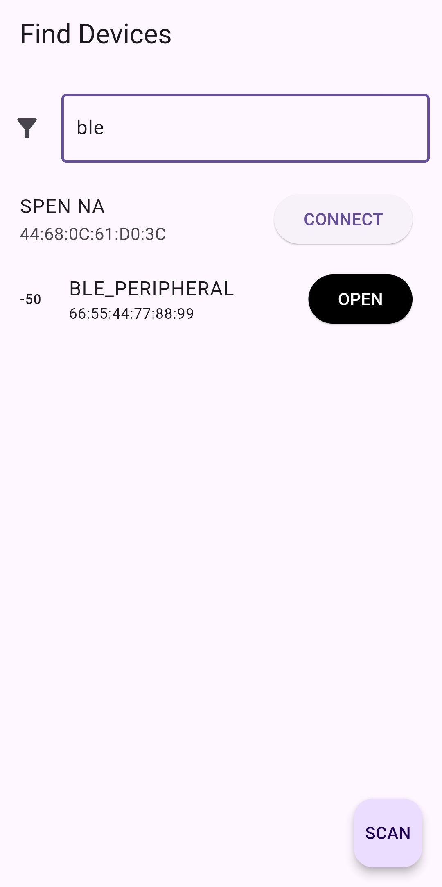
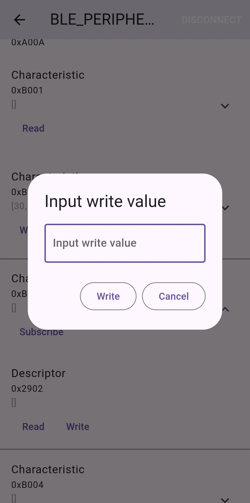

# flutter_ble_mon

Flutter project for ble feature implementation
Basic package : flutter_blue_plus
Target device : Android phone & RTL8720CM module

## Feature

- Basic sample code from flutter_blue_plus was implemented
- Filtering advertising text to avoid lots of list
  
- Write value pop up screen
  

## TODO

- ~~Device name filtering~~
  - ~~There are too many N/A~~
  